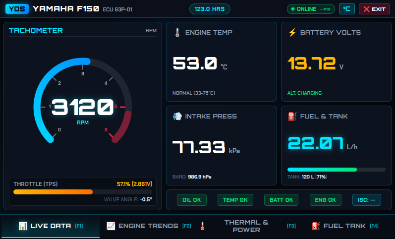

# Yamaha YDS Telemetry System & Data Logger

A real-time telemetry decoding engine and marine helm web dashboard for **Yamaha Outboard Engines** (calibrated for Yamaha F150 ECU `63P-8591A-01` / `63P-01`) connected via a 12V ISO 9141 K-Line USB diagnostic adapter to a Raspberry Pi or PC.

## Dashboard



---

## 1. Wiring & Hardware Requirements

### Connector Pinout: USB OBD2 Adapter to Yamaha 3-Pin YDS Port

| OBD2 Cable Pin | YDS 3-Pin Connector Wire | Description | Notes |
| :--- | :--- | :--- | :--- |
| **Pin 16** | **Red Wire** | +12V Power | Switched +12V DC from Engine Harness |
| **Pin 4 / Pin 5** | **Black Wire** | Engine / Battery Ground | Chassis / Battery Negative Ground |
| **Pin 7 (K-Line)** | **Data Wire** (Yellow/White) | ISO 9141 K-Line Data Signal | ~4V–12V TTL Data Line (Do NOT use Pin 15 L-Line) |

- **Yamaha Outboard Engine:** F150 / F115 / F200 / F225 (ECU `63P-8591A-01` / `63P-01`).
- **USB K-Line Adapter:** 12V ISO 9141-2 K-Line diagnostic cable (`/dev/ttyUSB0`).
- **USB GPS / GNSS Receiver:** u-blox 7 USB GNSS Receiver (Vendor ID `1546`, Product ID `01a7`, `cdc_acm` driver, device `/dev/ttyACM0`). Parses NMEA `$GPRMC` and `$GPGGA` sentences to provide real-time Vessel Speed (KTS), Heading/Course (°N), Satellite Fix State, Satellite Count, calculates Live Fuel Economy (**`L/NM`** = Fuel Rate L/h / Speed KTS), and **automatically synchronizes host system clock** if local time drifts by more than 5.0 seconds from satellite GPS UTC.

> [!IMPORTANT]
> **Ignition Key Requirement:** The boat ignition key switch **MUST BE ON** for the ECU to power up and respond to K-Line requests.

---

## 2. Installation & Environment Setup

### A. System Dependencies

Update packages and install Python 3, virtual environment tools, and `udev`:

```bash
sudo apt update && sudo apt install -y python3-pip python3-venv git udev
```

### B. Python Virtual Environment

Clone or navigate to the project directory, create a virtual environment, and install required modules:

```bash
cd /home/pi/yamaha-data-logger
python3 -m venv venv
source venv/bin/activate

pip install pyserial fastapi uvicorn websockets
```

---

## 3. Serial Port & USB Permissions (`udev` Setup)

### A. Grant User Permissions
Allow the non-root user to access serial devices:

```bash
sudo usermod -a -G dialout $USER
```
*(Log out and log back in or reboot for group changes to take effect).*

### B. Create Persistent `udev` Rule (Recommended)
To assign a fixed device symlink (e.g. `/dev/ttyUSB-yds`) regardless of USB port plugging order:

1. Identify USB serial chipset vendor & product ID:
   ```bash
   lsusb
   ```
   *(Common chipsets: FTDI `0403:6001` or CH340 `1a86:7523`)*

2. Create a `udev` rule file:
   ```bash
   sudo nano /etc/udev/rules.d/99-yamaha-yds.rules
   ```

3. Add the rule lines (adjust `idVendor`/`idProduct` if necessary):
   ```udev
   # Yamaha YDS K-Line Cable (/dev/ttyUSB0 -> /dev/ttyUSB-yds)
   SUBSYSTEM=="tty", ATTRS{idVendor}=="0403", ATTRS{idProduct}=="6001", SYMLINK+="ttyUSB-yds", GROUP="dialout", MODE="0666"

   # u-blox 7 GPS Receiver (/dev/ttyACM0 -> /dev/ttyACM-gps)
   SUBSYSTEM=="tty", ATTRS{idVendor}=="1546", ATTRS{idProduct}=="01a7", SYMLINK+="ttyACM-gps", GROUP="dialout", MODE="0666"
   ```

4. Reload `udev` rules:
   ```bash
   sudo udevadm control --reload-rules && sudo udevadm trigger
   ```

---

## 4. Testing & Verification Workflow (Step-by-Step)

Follow these steps to verify hardware connection, K-Line communication, serial handshakes, and telemetry parsing.

### Step 1: Cable Offline Self-Test (Disconnected from Engine)
Verify local cable loopback behavior before plugging into the engine:

```bash
python3 tests/test_yds_hardware.py --port /dev/ttyUSB0
```
- **Expected Outcome:** Determines whether the adapter echoes bytes locally (cable internal loopback) or only when connected to an active K-Line bus.

### Step 2: Bus Scanner & Opcode Discovery (Optional)
Run an exhaustive bus scan to probe wakeup handshakes and custom query opcodes:

```bash
python3 tests/scan_yamaha_yds.py --port /dev/ttyUSB0
```

### Step 3: YDS Reader CLI Direct Polling Test
Test the calibrated telemetry decoder directly in the terminal to verify live parameter reading:

```bash
python3 app/yds_reader.py --port /dev/ttyUSB0 --baud 9600
```
- **Expected Outcome:** Displays real-time RPM, Engine Operating Hours, TPS %, MAP Pressure, Oil Pressure, and Temperatures directly in the console output.

### Step 4: Web Server & Live Telemetry Dashboard
Launch the FastAPI WebSocket server and dashboard interface:

```bash
python3 app/server.py --serial-port /dev/ttyUSB0 --gps-port /dev/ttyACM0 --baud 9600 --web-port 8000
```
- Open a web browser to **`http://localhost:8000`** or **`http://<RPI-IP>:8000`**.
- Verify REST status API: `http://localhost:8000/api/status`

### Direct File Transfer (SCP Deployment)
If copying repository files directly to a remote Raspberry Pi via `scp` (without `git clone`), ensure all core Python modules and static assets are included:
```bash
scp -r app/ tools/ requirements.txt admin@<PI-IP>:/path/to/yamaha-data-logger/
```

---

## 5. Simulation / Mock Mode (Testing Without Hardware)

You can run both the reader CLI and the web server in mock mode to test the UI or develop software without connecting to the engine:

- **CLI Reader Mock:**
  ```bash
  python3 app/yds_reader.py --mock
  ```
- **Web Server Mock:**
  ```bash
  python3 app/server.py --mock --web-port 8000
  ```

---

## 6. Systemd Auto-Start Service (Run on Boot)

To run the telemetry server automatically when the system boots:

1. Create service file:
   ```bash
   sudo nano /etc/systemd/system/yamaha-telemetry.service
   ```

2. Add configuration:
   ```ini
   [Unit]
   Description=Yamaha YDS Real-Time Telemetry Web Server
   After=network.target

   [Service]
   Type=simple
   User=pi
   WorkingDirectory=/home/pi/yamaha-data-logger
   ExecStart=/home/pi/yamaha-data-logger/venv/bin/python3 /home/pi/yamaha-data-logger/app/server.py --serial-port /dev/ttyUSB0 --gps-port /dev/ttyACM0 --web-port 8000
   Restart=always
   RestartSec=5

   [Install]
   WantedBy=multi-user.target
   ```

3. Enable and start service:
   ```bash
   sudo systemctl daemon-reload
   sudo systemctl enable yamaha-telemetry.service
   sudo systemctl start yamaha-telemetry.service
   ```

4. Monitor status & logs:
   ```bash
   sudo systemctl status yamaha-telemetry.service
   journalctl -u yamaha-telemetry.service -f
   ```

---

## 7. Multi-Device & Kiosk Display Setup

### A. Secondary Displays (Tablets & Mobile Phones)
Connect phones or tablets to the boat Wi-Fi or Raspberry Pi hotspot and navigate to:
```
http://<RASPBERRY-PI-IP>:8000
```
The server broadcasts WebSocket telemetry to multiple concurrent client devices with ultra-low latency.

### B. Raspberry Pi 7" Touchscreen Kiosk Mode (800 x 480 Resolution)
To launch Chromium automatically in full-screen 800x480 kiosk mode on boot:

1. Install dependencies:
   ```bash
   sudo apt install -y chromium-browser unclutter
   ```

2. Add autostart entries in `~/.config/lxsession/LXDE-pi/autostart` (or Wayland/labwc config):
   ```bash
   @xset s off
   @xset -dpms
   @xset s noblank
   @unclutter -idle 0.5 -root
   @chromium-browser --noerrdialogs --disable-infobars --kiosk --window-size=800,480 --window-position=0,0 http://localhost:8000
   ```

---

## 8. Debugging & Hardware Troubleshooting

### Symptom: TX Echo Received, but 0 ECU Response Bytes Returned

If diagnostic scripts show transmitted bytes echoed back but no response payload from the ECU:

1. **Ignition Key Switch:**
   - Confirm key switch is turned **ON**. The ECM requires +12V power to transmit telemetry.
2. **Voltage Levels (4V/5V TTL vs 12V OBD2 Transceivers):**
   - Disconnected Yamaha YDS K-Line floats around ~4V DC (5V TTL logic level).
   - Standard 12V OBD2 transceivers (e.g. L9637D, MC33660) powered by 13.8V have a ~7.0V–9.6V receiver threshold and will ignore 4V pulses!
   - **Fix:** Supply +5V (instead of 12V) to OBD2 Pin 16, or use a 5V USB-to-TTL serial adapter.
3. **Multimeter Engine Connector Checklist:**
   - **Ground (Black Wire):** 0 Ω resistance to battery negative.
   - **Power (Red Wire):** +12.5V to +14.4V DC to Ground.
   - **Data Wire (Yellow/White):** +10V to +12V DC to Ground (disconnected ECU side). If Data wire reads 0V DC when disconnected, check harness wiring or ECU main relay.

---

## 9. Packet Sniffing & Capturing (Linux Host + Windows VM)

To capture raw packets when running official Windows YDS software in a VirtualBox VM:

### Method A: Virtual Serial Port PTY Proxy (`sniff_yds.py`)
*Best for VirtualBox Serial Port Passthrough (`COM1`)*

1. Start the proxy script on Linux:
   ```bash
   python3 sniff_yds.py
   ```
   This creates a virtual serial port symlink `/tmp/ttyYDS`.

2. In VirtualBox VM Settings $\rightarrow$ **Serial Ports**:
   - Enable Serial Port 1
   - Port Mode: **Host Device** / **Host Pipe**
   - Path/Address: `/tmp/ttyYDS`

3. Launch Windows YDS inside the VM. All `[VM -> ECU]` requests and `[ECU -> VM]` responses are logged in real-time to stdout and `yds_sniff_log.txt`.

### Method B: Linux Kernel `usbmon` Raw USB Sniffer (`tools/sniff_usbmon_raw.py`)
*Best for VirtualBox USB Device Passthrough*

1. Enable the Linux kernel `usbmon` module:
   ```bash
   sudo modprobe usbmon
   sudo chmod 666 /dev/usbmon*
   ```

2. Run the raw USB packet capture script:
   ```bash
   python3 tools/sniff_usbmon_raw.py --bus 1
   ```
   All low-level USB URB transfer packets will be logged to stdout and `logs/yds_usb_raw_sniff.log`.

---

## 10. Reverse-Engineered Yamaha ECU Protocol & Standalone Unlock Specification

Through low-level USB URB packet capture ([logs/yds_usb_raw_sniff.log](file:///home/daniel/src/yamaha-data-logger/logs/yds_usb_raw_sniff.log)) and empirical hardware testing, the exact protocol required to unlock and read Yamaha YDS ECUs (e.g. F150 / `63P-8591A-01`) **100% standalone on Raspberry Pi / Linux** without Windows or VirtualBox has been decoded:

### A. Standalone Hardware Baud-Rate Switch Unlock
When starting from a cold ignition power-on, standard 9600-baud queries receive only 1-byte TX echoes because the ECU's diagnostic UART comparator is in sleep mode. To wake up and unlock the ECU:

1. **Open FTDI Serial Port** (`/dev/ttyUSB0` / `/dev/ttyUSB-yds`).
2. **Switch to 2400 Baud** (`ser.baudrate = 2400`).
3. **Switch to 300 Baud** (`ser.baudrate = 300`) and transmit 1-byte sync opcode `0x1C`.
4. **Switch to 9600 Baud** (`ser.baudrate = 9600`).
5. **Assert DTR & RTS Lines HIGH** (`ser.dtr = True`, `ser.rts = True`).

This hardware baud-rate transition triggers the K-Line level shifter and wakes up the ECU's diagnostic UART interrupt.

### B. Sequential YDS Telemetry Frame Protocol
Once unlocked, the ECU requires every polling cycle to execute a structured frame sequence:

$$\text{Frame Sequence: } \mathtt{0x1C} \rightarrow \mathtt{0xFD} \rightarrow \mathtt{0xE5} \rightarrow \mathtt{0xE8} \rightarrow \mathtt{0xFE} \rightarrow \mathtt{0xFF} \rightarrow \mathtt{0xDE} \rightarrow \mathtt{0xD0} \rightarrow \mathtt{0xF0} \rightarrow \mathtt{0xEF} \rightarrow \mathtt{0x00} \rightarrow \mathtt{0x01} \rightarrow \mathtt{0x04} \rightarrow \mathtt{0x05} \rightarrow \mathtt{0x08} \rightarrow \mathtt{0x09} \rightarrow \mathtt{0x0B} \rightarrow \mathtt{0x0E} \rightarrow \mathtt{0x0F} \rightarrow \mathtt{0x1B} \rightarrow \mathtt{0x1D} \rightarrow \mathtt{0x40} \rightarrow \mathtt{0x41} \rightarrow \mathtt{0x51} \rightarrow \mathtt{0x91} \rightarrow \mathtt{0xE9} \rightarrow \mathtt{0x02} \rightarrow \mathtt{0x03} \rightarrow \mathtt{0xF1}$$

### C. Opcode Mapping & Data Conversion Table

| Opcode(s) | Parameter | Type | Conversion / Formula | Example Raw $\rightarrow$ Decoded Value |
| :---: | :--- | :---: | :--- | :--- |
| `0x1C` | Diagnostic Sync / Heartbeat | 8-bit | Handshake & Watchdog Reset | Payload `0x03` |
| `0xFD` | Diagnostic Session Unlock | 8-bit | Diagnostic Mode Unlock | Payload `0x00` |
| `0xE8` / `0xE5` | Total Engine Hours | 16-bit | $\text{Hours} = ((\text{High} \ll 8) \mid \text{Low}) \times 1.00687$ | `0x01EF` (495) $\rightarrow$ **498.4 Hours** |
| `0xFE` | ECU Status | 8-bit | Status Flags | Payload `0x00` |
| `0xFF` | ECU Model Sub-ID | 8-bit | Hardware Identification | `0x06` $\rightarrow$ **Yamaha 63P-01** |
| `0xDE` / `0xD0` | Subsystem Unlock | 8-bit | Diagnostic Mode Flags | Payload `0x00` |
| `0x91` / `0xF0` | Engine Temperature | 8-bit | $\text{°C} = \text{Raw}_{91} - 5.0$ | `0x30` (48) $\rightarrow$ **43.0 °C / 109.4 °F** |
| `0xEF` / `0x1B` | Intake Air Temperature | 8-bit | $\text{°C} = \text{Raw}_{EF} \times 0.9655 - 23.94$ | `0x33` (51) $\rightarrow$ **25.3 °C / 77.5 °F** |
| `0x00` / `0x01` | Engine Speed (RPM) | 16-bit | $\text{RPM} = (\text{High} \ll 8) \mid \text{Low}$ | `0x0289` (649) $\rightarrow$ **649.0 r/min**, `0x0D6D` (3437) $\rightarrow$ **3437.0 r/min** |
| `0x1D` | Throttle Position (TPS) | 8-bit | $\text{V} = 0.679 + (\text{Raw}_{1D} - 67) \times 0.014246$, $\text{deg} = -0.5 + (\text{Raw} - 67) \times 0.355738$ | `0x43` (67) $\rightarrow$ **0.679 V / -0.5 deg (0%)**, `0x80` (128) $\rightarrow$ **1.548 V / 21.2 deg (24.0%)** |
| `0x0B` / `0x05` | Manifold Pressure (MAP) | 8-bit | Running: $\text{kPa} = 124.915 - (\text{Raw}_{0B} \times 0.530253)$ | `0x8B` (139) $\rightarrow$ **51.21 kPa**, `0x3B` (59) $\rightarrow$ **93.10 kPa** |
| `0x05` | Barometric Pressure | 8-bit | $\text{hPa} = \text{Raw}_{05} \times 4.1556$ | `0xF1` (241) $\rightarrow$ **1001.5 hPa** |
| `0x41` / `0x0D` | ISC Valve Opening | 8-bit | $\text{\%} = \text{Raw}_{41} / 1.703125$ | `0x6D` (109) $\rightarrow$ **64.0 %**, `0xA3` (163) $\rightarrow$ **96.0 %** |
| `0x0E` / `0x0F` | Oil Pressure | 16-bit | $\text{kPa} = 347.4 + (\text{Raw}_{0E/0F} - 2549) \times 0.033739$ | `0x09F5` (2549) $\rightarrow$ **347.4 kPa / 50.4 PSI**, `0x1344` (4932) $\rightarrow$ **427.8 kPa / 62.6 PSI** |
| `0x04` / `0x40` | Battery Voltage | 16-bit | $\text{Volts} = 13.64 + (\text{Raw}_{04/40} - 656) \times 0.031875$ | `0x0290` (656) $\rightarrow$ **13.64 V**, `0x02A0` (672) $\rightarrow$ **14.15 V** |
| `0x1E` / `0x1F` | Fuel Injector Duration | 16-bit | $\text{ms} = 2.61 + (\text{Raw}_{1E/1F} - 437) \times 0.00630728$ | `0x01B5` (437) $\rightarrow$ **2.61 ms**, `0x0328` (808) $\rightarrow$ **4.95 ms** |
| `0xF1` | Streaming Enable | 8-bit | Streaming Session Keep-Alive | Refresh every $\le 8$ seconds |

### D. Session Watchdog & Auto-Recovery
* The Yamaha ECU maintains an internal **45-second diagnostic session watchdog timer**. If no keep-alive command (`0xF1`) is received for 45 seconds, the ECU drops back to non-diagnostic mode.
* [yds_reader.py](file:///home/daniel/src/yamaha-data-logger/yds_reader.py) automatically handles periodic 8-second keep-alive heartbeats and includes automatic re-activation recovery if the connection is ever interrupted.

---

## 11. Raw Telemetry Logging & Offline Replay System

You can record raw Yamaha ECU opcode responses to a file on your boat or laptop and replay them offline to test and refine calibration formulas without needing the boat or engine running.

### A. Logging Raw ECU Telemetry to File (`tools/raw_logger.py`)

Run `tools/raw_logger.py` to record real-time raw opcode snapshots from the ECU to a JSON Lines (`.jsonl`) log file. By default, it sweeps **all 256 ECU opcodes (`0x00` through `0xFF`)** to capture complete raw diagnostic data:

```bash
# Record full 256-opcode ECU sweep (0x00 - 0xFF) at 1 Hz
python3 tools/raw_logger.py --port /dev/ttyUSB0

# Record high-rate 5 Hz stream of primary 31 telemetry opcodes
python3 tools/raw_logger.py --port /dev/ttyUSB0 --primary-only --rate 5.0

# Record to a specific file for a fixed duration (e.g., 60 seconds)
python3 tools/raw_logger.py --port /dev/ttyUSB0 --output logs/engine_run_idle.jsonl --duration 60
```

### B. Offline Replay & Calibration Testing (`tools/replay_raw.py`)

Replay recorded `.jsonl` raw telemetry logs, view real-time decoded output, test modified formulas, or export to CSV:

```bash
# Replay raw log frame-by-frame in real-time
python3 tools/replay_raw.py --input logs/engine_run_idle.jsonl

# Replay at 2x speed and export decoded telemetry to CSV
python3 tools/replay_raw.py --input logs/engine_run_idle.jsonl --speed 2.0 --export-csv calibration_test.csv

# Instant full-file calibration analysis (0x speed)
python3 tools/replay_raw.py --input logs/engine_run_idle.jsonl --speed 0
```

### C. Replaying Raw Logs in the Web Dashboard (`app/server.py`)

Stream recorded raw ECU log files directly to the web dashboard UI:

```bash
python3 app/server.py --replay-file logs/engine_run_idle.jsonl --gps-port /dev/ttyACM0 --web-port 8000
```

